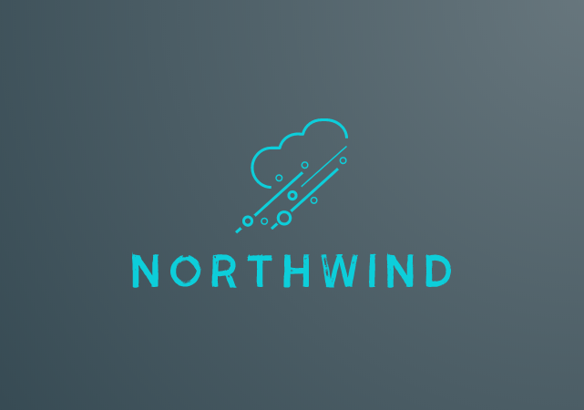

# Northwind

  

Northwind is a Vulkan  Engine, mainly focus on rendering.

I will work on this engine in order to let it be a proper engine and I'm writing this out of my experience of my previous engine [Ion](https://github.com/KabalMcBlade/Ion)

## Status

**[x64] Work in progress**

## LICENSE

- Sources:
	- **Northwind**, the main project, is under GPL-3.0
	- **Eos** and **Nix** are under Apache-2.0
	- **json.hpp** is under MIT License
	- **stb_image.h** is under MIT License OR Public Domain
	- **stb_image_write.h** is under MIT License OR Public Domain
	- **tiny_gltf.h** is under MIT License
	- **tiny_ktx.h** is under MIT License

- Assets:
	- **colored_glass_rgba.ktx** found in the Sascha Willems data repository of his Vulkan Samples, within the readme with the license [Vulkan samples](https://github.com/SaschaWillems/Vulkan)
	- **gcanyon_cube.ktx** found in the Sascha Willems data repository of his Vulkan Samples, within the readme with the license [Vulkan samples](https://github.com/SaschaWillems/Vulkan)
	- **misty_pines_4k.hdr** is under CC0 license (https://creativecommons.org/publicdomain/zero/1.0/) and was downloaded from here https://hdrihaven.com/hdri/?c=morning-afternoon&h=misty_pines
	- **Yokohama3** is under Creative Commons Attribution 3.0 Unported License http://creativecommons.org/licenses/by/3.0/
	- **Damaged Helmet** is under a Creative Commons Attribution-NonCommercial license: https://github.com/KhronosGroup/glTF-Sample-Models/tree/master/2.0/DamagedHelmet

### About dependencies

About how to use the dependencies please take a look to their own owner. (also for the mine!)

# Build Status

|  Platform  | Branch | Build Status |
|:----------:|:------:|:------------:|
| Windows (Visual Studio 2017) | Dev |  |
| Windows (Visual Studio 2017) | Master |  |
